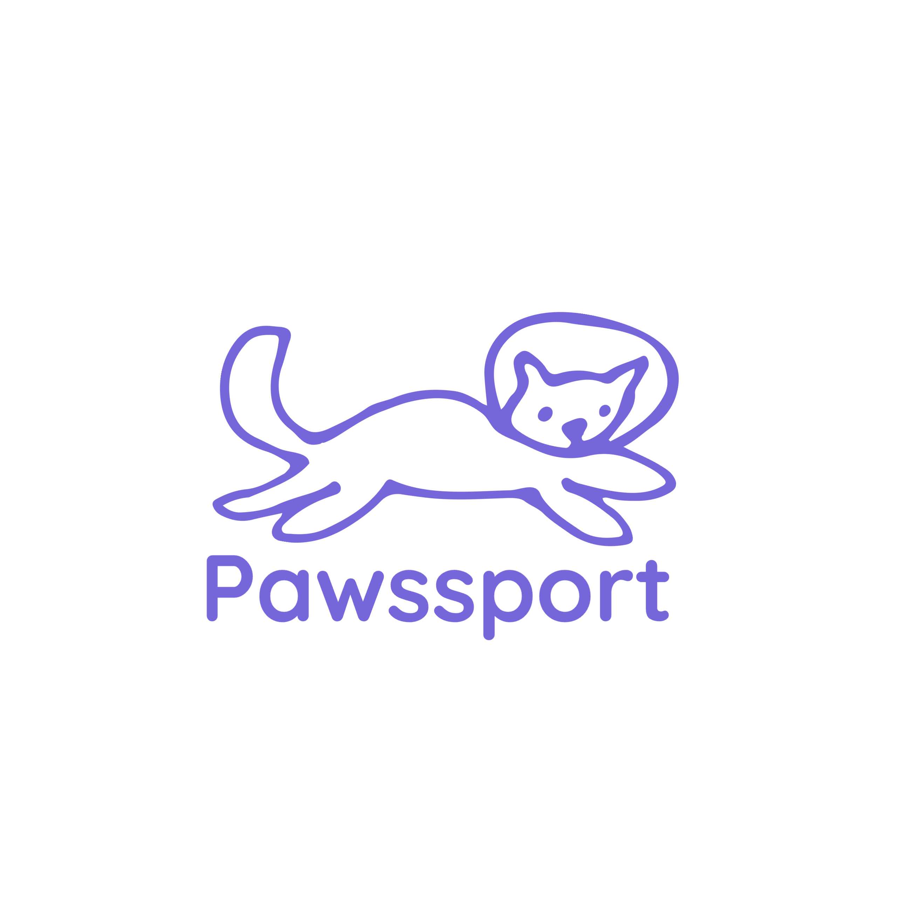

  

Pawssport is a dedicated social network platform for the community of pet enthusiasts, particularly those who love to travel with their furry friends. Whether you're looking to share a cherished memory of a beach day with your dog or seeking advice on cat-friendly cafes in Paris, Pawssport is your go-to destination.

[Introduction](#introduction) •
[User Research and Analysis](#uxresearch) •
[Design and User Experience](#design) •
[Development Process](#development-process) •
[Usability Testing](#usabilitytesting) •
[Contributions](#contribution) •

---

##  :point_right: Introduction

### Features
- :feet:  **User Authentication**: Easily sign up using an email-password combination or streamline the process with Google authentication.
-  :feet:  **Dynamic Posting**: Share your pet-related adventures, edit them as memories evolve, or delete them if you change your mind.
- :feet:  **Engagement**: Engage with the community by liking posts, and let others engage with your shared memories.
- :feet:  **User-centric Design**: Navigate through the community's collective experiences on the home view, or curate your own pet tales in a personal profile space.

#### The Problem Pawssport Addresses 
Every day, millions of pet owners around the world face challenges when traveling or going on adventures with their pets. From not knowing which places are pet-friendly to lacking insights on how to handle pets during different travel scenarios, there’s a void of collective knowledge and shared experiences. Furthermore, traditional social media platforms don’t cater specifically to this niche, leaving pet lovers scattered and their experiences diluted.

Of course, here are the user stories in Markdown format:

### User Stories

#### Story 1: Exploring New Adventures

As an avid pet lover like Pablo, I want to create an account on Pawssport to share my pet travel stories. This will allow me to connect with a community that shares my enthusiasm for traveling with furry companions. The acceptance criteria include:

- Users can create an account using a valid email and password or through Google authentication.
- Clear error messages are displayed if incorrect information is entered during account creation.
- Password requirements are outlined, and users have the option to reveal their password.
- The interface is responsive, aligning with established style guidelines.
- User data is securely stored using Firebase authentication.
- The feature has undergone code review and unit testing.

#### Story 2: Easy Access and Engagement

Carolina, a user of Pawssport, aims to effortlessly access her account and find travel tips for her feline friend, Felix. She values the option to sign in using her email and password or through Google. The criteria for this story include:

- Users can log in using their email and password or their Google account.
- Clear error messages are displayed if login credentials are incorrect.
- The user can explore the platform's feed and navigate to their profile.
- The interface maintains responsiveness and adheres to design guidelines.
- User data remains secure through Firebase authentication.
- The feature has been subjected to code review and unit testing.

#### Story 3: Sharing and Editing Experiences

José, an active member of Pawssport, desires to share valuable travel tips and update his posts as his pet-related experiences evolve. He values the ability to edit and delete his posts. The acceptance criteria include:

- Users can create, edit, and delete their posts.
- Upon clicking the edit button, the post's text transforms into an editable input field.
- Users can save changes and revert to normal view mode.
- The interface maintains responsiveness and adheres to design guidelines.
- User data is securely stored using Firebase.
- The feature has undergone code review, unit testing, and usability testing.

#### Story 4: Discovering and Interacting

As an aspiring traveler, Manuela wishes to read about other users' pet travel experiences to prepare for her upcoming journey. She wants the ability to like posts that resonate with her. The criteria for this story include:

- Users can access a "Home" section containing posts from other users.
- Users can like and unlike posts.
- Each user can only like a post once.
- The interface maintains responsiveness and adheres to design guidelines.
- User data is securely stored using Firebase.
- The feature has undergone code review, unit testing, and usability testing.

These user stories embody the core functionalities and interactions within Pawssport, reflecting a diverse range of user needs and desires that we've aimed to address in our platform design.

---

##  :point_right: User Research and Analysis
We conducted a survey using [this form](https://form.jotform.com/232084743834661) to gather insights from potential users. A total of 27 responses were collected, providing valuable data for our project.You can access the full report of our survey results here: - [User Research Report](https://www.jotform.com/report/23208681728205628?st=N0RCa2Y2Z3pocG0rVmJRUWdlOW5tQlhWQWxxK2RxYlYzU3FjdTh3dVZTT0FNZEJLRndQNmh0MUhEenBCM0JwQzlMM2NMTU81RmYzSDZTOW8wTjhVTDRsOEVwWGRVL2tSUStQNDhacTM4dTh2cENCTUdaelFKMjNjS1JwUDZwTVU=)

### Survey Results:

- **Travel Experience with Pets:** When asked about their travel experiences with pets, 71% of respondents had not traveled with their pets, while the remaining 29% had.

- **Reasons for Traveling with Pets:** Among those who traveled with their pets, 41% mentioned that they did so to avoid leaving their pets alone, 29% did it to alleviate their pets' stress, and 24% found it enjoyable.

- **Interest in Traveling with Pets:** Interestingly, 71% of all respondents expressed an interest in traveling with their pets, while the remaining 29% did not consider it.

- **Community Participation:** A significant 75% of the surveyed users indicated that they would like to be part of a community where pet experiences are shared.

These survey findings shed light on the attitudes and preferences of potential users, highlighting a strong desire for a platform like Pawssport that caters to pet travel experiences. The insights gathered from this survey will be instrumental in shaping the features and functionalities of our social network.

### The Solution :raised_hands::sparkles:
Pawssport brings together pet enthusiasts in a singular, dedicated platform. It serves as a collective diary of shared pet adventures, allowing users to not only flaunt their experiences but also gain insights from others. Whether you're a novice pet owner preparing for your first trip or a seasoned traveler with pets looking for new adventures, Pawssport provides a space to both learn and share. :smile_cat::rainbow:

---

##  :point_right: Design and User Experience

In the design and user experience phase, our focus was on creating an engaging and visually captivating platform that embodies the essence of Pawssport as a dedicated social network for sharing pet travel tips. The design reflects adventure, playfulness, and warmth, establishing a strong connection between users, their pets, and their shared experiences.

### Color Palette and Visual Identity

We carefully curated a color palette that captures the spirit of pet travel experiences. The following colors were selected to evoke emotions of companionship, exploration, and excitement:

- **Royal Purple (#6A66D9)**
- **Pale Lavender (#C2C9F2)**
- **Baby Blue (#D8E8F2)**
- **Coral (#D98162)**
- **Crimson Red (#F25244)**
- **Charcoal Gray (#232526)**
- **Slate Gray (#4F5559)**
- **Light Gray (#F2F2F2)**

This palette enhances visual clarity, accessibility, and user engagement throughout the platform.

### Typography and Font Selection

To complement the color palette and establish a consistent brand identity, we chose the "Montserrat" font family. Its modern and clean appearance enhances readability while adding a touch of sophistication and approachability.

### Design Approach: Minimalist and Playful

Pawssport's design follows a minimalist yet playful approach, ensuring a user-friendly and enjoyable experience. The minimalism reduces clutter, allowing users to focus on content, while playful elements, such as subtle animations and pet-themed icons, infuse joy into interactions. This balance fosters a strong connection between users, their pets, and their shared stories.

### Prototyping: From Low-Fidelity to High-Fidelity

Our prototyping process involved two stages: low-fidelity and high-fidelity prototypes.

**Low-Fidelity Prototypes:**
- [View Low Fidelity Mobile Prototype](https://www.figma.com/file/UBQNGtOpSKFJWE4yAbhNyx/Untitled?type=design&node-id=0-1&mode=design&t=Kd9kUA0bYju2GsjU-0)
- [View Low Fidelity Desktop Prototype](https://www.figma.com/file/znPFqN98qQxrCIFTznmAAi/Prototipo-baja-resolución-Pawssport?type=design&node-id=0-1&mode=design&t=KBkoIMofHs2aCmip-0)

**High-Fidelity Prototypes:**
- [View High Fidelity Mobile Prototype](https://www.figma.com/file/gBimm1vWngkus7vRenfP4N/Prototype-Pawssport?type=design&node-id=0%3A1&mode=design&t=esgOiKZD0RJrRgvL-1)
- [View High Fidelity Desktop Prototype](https://www.figma.com/proto/gBimm1vWngkus7vRenfP4N/Prototype-Pawssport?type=design&node-id=256-163&t=eGBmCBMe41w1440E-1&scaling=scale-down&page-id=256%3A162&starting-point-node-id=256%3A163&show-proto-sidebar=1&mode=design)

By blending thoughtful color choices, typography, and a minimalist yet engaging design, Pawssport provides an immersive and delightful user experience. Users are encouraged to share their cherished pet travel memories and connect with fellow pet enthusiasts in a visually appealing and intuitive environment.

---

## :point_right: Development Process

The development of Pawssport was a collaborative effort that involved a dedicated team of developers and designers. We employed agile methodologies to plan, execute, and deliver functionalities in an iterative manner. Our focus was on efficiency, constant communication, and adaptability as we progressed through the development.

### Planning and Collaborative Work

To plan and track our work, we utilized GitHub Projects. You can view our planning board directly on GitHub: [Pawssport GitHub Project Board](https://github.com/users/agiraldomolina/projects/2/views/1).

Within this board, we divided functionalities into cards and organized them into columns based on their status, such as "To Do," "In Progress," and "Done." This approach allowed us to clearly visualize the progress of each task and assign them to team members.

### Agile Methodology

We embraced an agile methodology to maintain flexibility and responsiveness as new ideas and challenges arose. Regular team meetings were held to review project status, set priorities, and adjust our focus as needed. Iterations enabled us to consistently deliver valuable functionalities and maintain ongoing feedback among team members.

### Use of GitHub and Version Control

GitHub played a pivotal role in our collaboration and version control. We employed repositories to store and share source code, making pull requests for code review and merging changes. Feature branches enabled parallel work without interference and ensured seamless integration of functionalities.

### Communication and Coordination

We maintained constant communication through channels such as Slack and online meetings. Additionally, we documented key decisions and technical details within our documentation repository to ensure shared understanding.

### Outcomes of Collaborative Work

Our collaborative development strategy empowered us to progress effectively, maintain a high level of quality, and deliver functionalities in a timely manner. Ongoing collaboration and detailed planning within GitHub Projects were instrumental in our success.

---

Sure, here's the section you can add to your document for usability testing with the final product. Please note that you can fill in the results once you have them:

---

## :point_right: Usability Testing

To ensure that Pawssport provides a seamless and user-friendly experience, we conducted usability testing with a select group of participants. The goal was to gather insights into the usability of the platform and identify any areas for improvement. We used the following form to collect usability testing results: [Usability Testing Form](https://form.jotform.com/231796850498675).

### Usability Testing Process

1. **Participant Selection:** We carefully selected participants who represent our target user demographic. This included individuals who love traveling with their pets and are interested in sharing their experiences on Pawssport.

2. **Test Scenarios:** Participants were provided with specific tasks to complete on the Pawssport platform. These tasks covered various aspects of the user journey, such as signing up, creating and editing posts, exploring the feed, and engaging with other users' content.

3. **Data Collection:** Participants used the platform while their interactions were recorded. They were encouraged to think aloud, sharing their thoughts and observations as they navigated the interface.

4. **Feedback and Observations:** We collected valuable feedback and observations from participants regarding their experience. This included insights into usability, navigation, clarity of instructions, and overall satisfaction.

### Usability Testing Results (Coming Soon)

We are currently in the process of analyzing the usability testing results to gain a comprehensive understanding of the user experience. Once the analysis is complete, we will update this section with detailed insights, observations, and recommendations based on the feedback received from participants.

Stay tuned for the finalized usability testing results, which will provide valuable insights into the strengths of Pawssport and opportunities for further enhancement.

---

### A Special Thank You
This project is the result of countless hours of effort, brainstorming, coding, and debugging. Behind every line of code, there's a story of dedication, dreams, adversities, resilience and passion. We hope that our work can be of help to others and make their journey a bit easier or inspiring 🩷.
Developed with an immense amount of love and care by:

- [Dulce Maria Ramirez](https://github.com/Dulceramr)
- [Alba Giraldo](https://co.linkedin.com/in/alba-giraldo-6086a046)
- [María Fernanda Orostegui](https://co.linkedin.com/in/mariaorostegui-webdev)