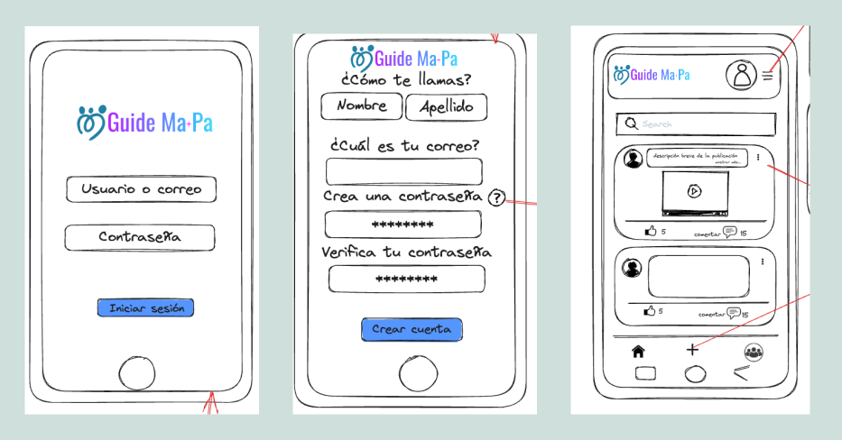
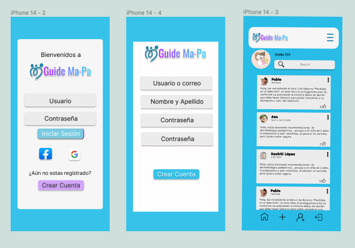
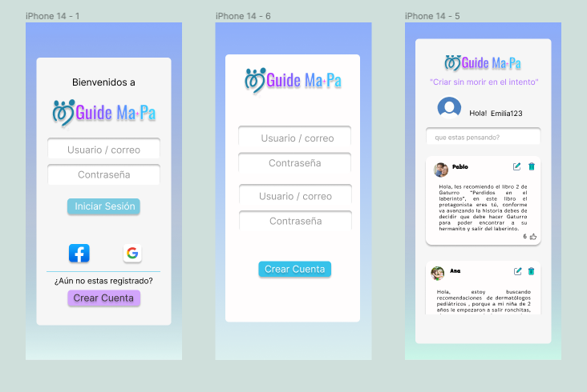

# Social Network:_Guide Ma+PA_

## Índice

* [1. Preámbulo](#1-preámbulo)
* [2. Definición del proyecto](#2-definición-del-proyecto)
* [3. Consideraciones generales](#3-consideraciones-generales)
* [4. Tecnologías Utilizadas](#4-tecnologías-utilizadas)
* [5. Flujo de trabajo](#5-flujo-de-trabajo)
* [6. Estructura de archivos](#6-estructura-de-archivos)
* [7. Pruebas unitarias](#7-pruebas-unitarias)
* [8. Interfaz desplegada](#8-interfaz-desplegada)
* [9. Desarrolladoras ](#9-desarrolladoras)

## 1. Preámbulo

El objetivo de este proyecto es adquirir conocimientos en el manejo de una _single page application (SPA)_, aprender a manejar herramientas como **Firebase** y ganar experiencia en el trabajo colaborativo a través de una situación y contexto ficticios. Nuestro objetivo es diseñar una interfaz interactiva que permita ingresar, validar datos e interactuar a través de una red social, nuestra tematica esta enfocada en el proceso diverso el cual es criar, y para ello hemos creado _Guide Ma+Pa_. 

## 2. Definición del proyecto
Para nuestro proyecto  **Guide Ma+Pa**, deberemos tener en cuenta las necesidades y expectativas de nuestros usuarios al momento de realizar el proceso de diseño de la interfaz,debemos comprender quiénes son nuestros usuarios y qué información desean ver y/o interactuar. Con base en esta comprensión, crearemos una interfaz amigable y fácil de usar que satisfaga las necesidades de nuestros usuarios.
## 3. Consideraciones generales
* Este proyecto se debe trabajar en equipos de tres.
* El rango de tiempo estimado para completar el proyecto es de 4 a 5 Sprints.
* La lógica del proyecto debe estar implementada completamente en JavaScript (ES6+), HTML y CSS 😃. (Sin hacer uso de librerias).

## 4. Tecnologías Utilizadas

**Github Project**: Es una herramienta de Github en la cual en lugar de aplicar una metodología específica a un proyecto proporciona características flexibles que puedes personalizar en función de las necesidades y los procesos del equipo, ya sea panel de tareas y/o hoja de ruta.

**Excalidraw**: Es una herramienta de pizarra colaborativa virtual que le permite esbozar fácilmente diagramas que parecen dibujados a mano.

**Firebase**: Es una plataforma para el desarrollo de aplicaciones web y aplicaciones móviles adquirida por Google. La cual utlizaremos apara la autenticación del usuario y el almacenamiento de la información de la app. 

**Vite**: Es una herramienta de compilación que tiene como objetivo proporcionar una experiencia de desarrollo más rápida y ágil para proyectos web, nos permite que el navegador automáticamente se actualice sin tener que refrescar y volver a cargar todo el sitio, al momento de realizar cambios.

**Figma**: Es una herramienta de diseño de interfaces de usuario, que permite crear, colaborar y prototipar diseños de manera eficiente y efectiva.

**HTML**: Es un lenguaje utilizado para estructurar y presentar contenido en la web, proporcionando elementos y etiquetas para crear y dar la estructura de una página.

**JavaScript**: Es un lenguaje de programación que se utiliza para agregar interactividad y funcionalidad a las páginas web, permitiendo crear efectos dinámicos, manipular datos y responder a las acciones del usuario.

**CSS**: Es un lenguaje de estilo utilizado para definir la presentación y apariencia visual de una página web, permitiendo controlar el diseño, el formato y los estilos de los elementos en el HTML. Y con su caracteristica _CSS Grid_ podemos adapatar el diseño.

**Git**: Es un sistema de control de versiones que facilita el seguimiento de los cambios en el código fuente, permitiendo gestionar y controlar las distintas versiones del proyecto, facilitando el trabajo colaborativo y la gestión de ramas y fusiones.

**GitHub**: Es una plataforma online basada en _Git_ que ofrece alojamiento de repositorios remotos y herramientas colaborativas, permitiendo compartir, colaborar y gestionar proyectos de forma más sencilla.

**Github Pages**: Permite a los usuarios de _GitHub_ crear y compartir sitios web públicos para proyectos, documentación, portafolios, etc.

**Jest**: Es un framework de pruebas unitarias de _JavaScript_, permite realizar afirmaciones y crear casos de prueba para verificar si el código se comporta como se espera.


## 5. Flujo de trabajo
Para establecer un flujo de trabajo eficiente, comenzamos organizando nuestro espacio en **Github Project**. Segmentamos todas las tareas requeridas en el proyecto, los objetivos de aprendizaje, las historias de usuario y los prototipos de baja y alta fidelidad. Progresivamente, profundizamos en cada uno de ellos, dividiéndolos en categorías como "Backlog", "Sprint Backlog" , "In progress", "In review" y "Ready". Este enfoque nos permitió tener una visión clara de las tareas pendientes y su progreso, lo que contribuyó a un desarrollo efectivo del proyecto.
## Definición del producto

Criar hijos es una de las experiencias más gratificantes y significantes de la vida de cualquier persona, sin embargo, es una tarea desafiante que requiere dedicación, paciencia y esfuerzo, lo cual es ¡agotador!. En Guide Ma+Pa, creemos firmemente que la crianza puede ser una aventura enriquecedora y positiva para padres y madres (mapadres) incluso para quienes aún no lo son. Nuestra plataforma ofrece un espacio seguro en donde puedes compartir recursos, consejos y apoyo para fomentar la colaboración en la crianza. Desde el anhelado embarazo hasta la desafiante adolescencia, queremos formar una comunidad confiable que brinde una experiencia gratificante y enriquecedora en este viaje maravilloso de criar.

¡Únase a Guide Ma+Pa y descubra la alegría de criar juntos!

## Historias de usuario

### Historia de usuario 1

### Historia de usuario 2

### Historia de usuario 3

## Diseño de la Interfaz de Usuario

En cuanto al diseño de la página, lo primero después de definir el tema a trabajar fue desarrollar un prototipo de baja fidelidad. Para ello realizamos prototipo de baja fidelidad en _Excalidraw_ que llevamos posteriormente a _Figma_.

### Prototipo de baja fidelidad en Excalidraw


### Prototipo de alta fidelidad en Figma


### Testeos de usabilidad a tráves de _Googleform_

Se solicito feedback a traves de un formulario y asi obtener opiniones y sugerencias para realizar mejoras iterativas de nuestro proyecto. Tras las diversidad de respuestas optamos por los siguientes cambios.


### Prototipo de alta fidelidad después del feedback 


## 6. Estructura de archivos
```
.
├── README.md
├── package.json
├── explaindev.json
├── vite.config.js
├── src
|  ├── lib 
|  |  ├── credentials.js
|  |  ├── firebaseConfig.js
|  |  ├── initializerFirebase.js
|  |  ├── localStore.js
|  ├── components 
|  |  ├── registrer.js
|  |  ├── login.js
|  |  ├── timeline.js
|  |  ├── error.js
|  |  ├── newPost.js
|  ├── images
|  ├── imagReadme
|  ├── styles
|  |  ├── registrer.css
|  |  ├── login.css
|  |  ├── timeline.css
|  ├── index.html
|  ├── main.js
└── test
   └── index.spec.js
```
## Detalle de archivos 

**main.js**:En este archivo estan configuradas las rutas y el comportamiento de la navegación en la aplicación, así como manejo del estado de autenticación de Firebase. 
**index.html**:Contiene la estructura básica de la página web.
**README.md**:
**package.json**:
**explaindev.json**:
**vite.config.js**:
**src**:

**lib**:
**firebaseConfig.js**: Contiene _"firebaseConfig"_ el cual es un objeto de configuración de Firebase. Este objeto contiene los valores necesarios para conectar la aplicación web con los servicios de Firebase. 
**initializerFirebase.js**: Es donde  se inicializa Firebase y se exportan varias funciones y objetos relacionados con la autenticación y la base de datos. 
**credentials.js**:esta enfocado en la autenticación y manejo de usuarios de la aplicación.
**localStore.js**:

**components**: 
**registrer.js**: Este componente crea y configura la interfaz de usuario para la página de registro.
**login.js**: Este componente crea y configura la interfaz de usuario para la página de inicio de sesión.
**timeline.js**: Este componente crea y configura la interfaz de usuario para el muro de la aplicación.
**error.js**: Este componente crea y configura la interfaz de usuario para mostrar un mensaje de error cuando se accede a una página que no se encuentra (error 404).
**newPost.js**:Este componente crea y configura la interfaz de usuario para permitir a los usuarios escribir y publicar nuevas publicaciones en el muro de la aplicación

**images**: Contiene las imágenes utilizadas en la página.
**imagReadme**: Contiene todas las imágenes de este readme.

**styles**:Esta carpeta, contiene los estilos CSS del sitio web, aplicados para darle una apariencia visual atractiva
**registrer.css**:
**login.css**:
**timeline.css**:

**index.spec.js**:

## 7. Pruebas unitarias

## 8. Interfaz desplegada
Versión móvil
Esta es la interfaz final de la aplicación web en la vista de movil equivalente a 480 px.

Versión tableta
Esta es la interfaz final de la aplicación web en la vista de tableta equivalente a 720 px.

Versión escritorio
Esta es la interfaz final de la aplicación web en la vista de escritorio.

## 9. Desarrolladoras
- [Andrea Aparicio _(MX)_](https://github.com/AndyApG)
- [Patricia Chavez Romo _(MX)_](https://github.com/patychavezromo)
- [Paulina Torres A. _(CL)_](https://github.com/Paulytorres/)