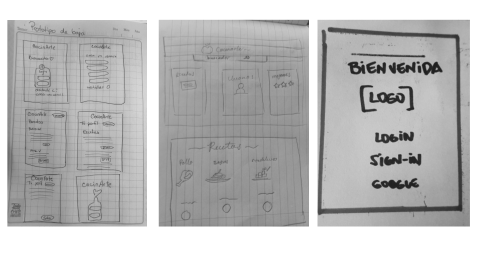
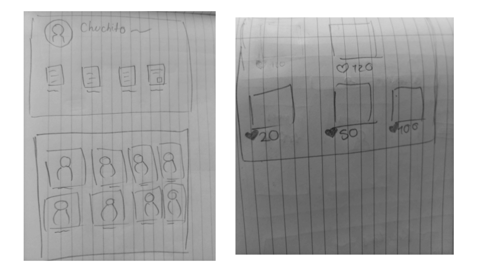
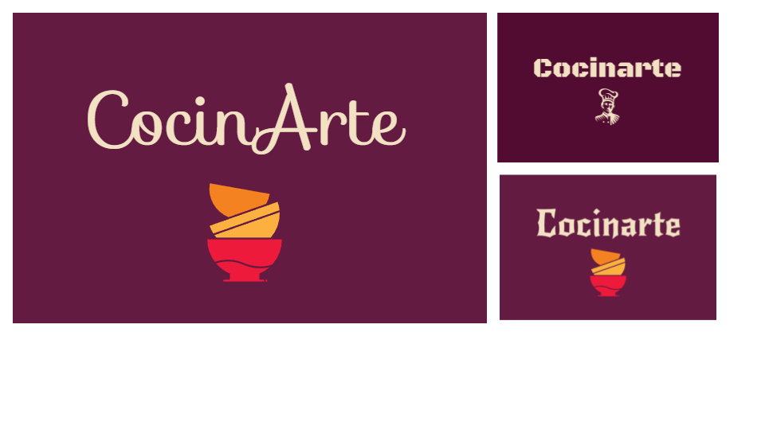
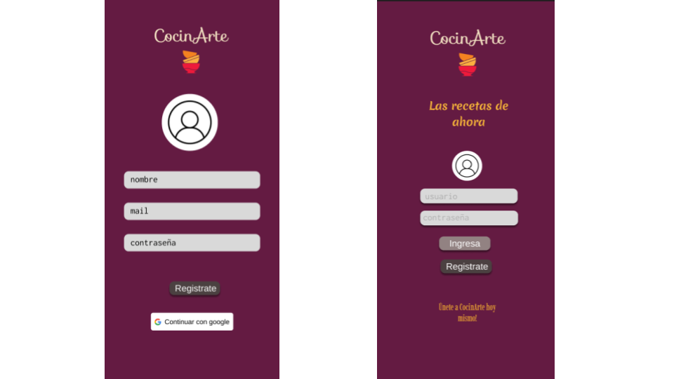
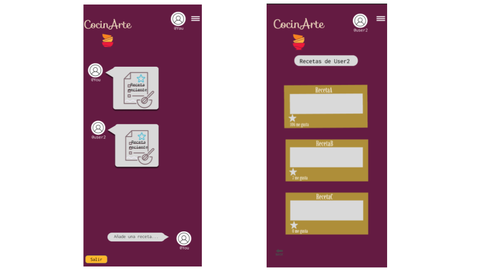

# Proyecto Social Network: cocinArte

## Índice

* [1. Definición del producto](#1-definicion-de-producto)
* [2. Historia de Usuarios](#2-objetivos-de-aprendizaje)
* [3. Desarrollo de Prototipos](#3-consideraciones-generales)
* [4. Proceso de trabajo / Retrospectiva SN5](#5-criterios-de-aceptación-mínimos-del-proyecto)

## 1. Definición de Producto

Desarrollamos una red social para compartir y ver recetas.
Muchas veces podemos encontrar recetas en diferentes lugares: Instagram, Facebook, blogs, pero pueden ser dificiles de guardar o se pierden entre tanta publicación: esta aplicación permite a usuarios poder acceder a recetas de manera sencilla. Es una comunidad en torno a la preparación de comida de cualquier parte del mundo.

Permite conectar a quienes le gusta compartir sus mejores recetas con otros cocineros y quienes están aprendiendo a cocinar o le faltan ideas para el día a día.

## 2. Historias de Usuario, criterios minimos de aceptación y definición de terminado

Definimos Historias de Usuario según cada entregable de la aplicación:

### Historia 1

Como: nueva usuaria

Quiero: crear una cuenta

Para: poder interactuar con la página

**Criterios de aceptacion**

- Poder ingresar con mi cuenta de Gmail 
- Si no tengo cuenta de gmail o no quiero logearme con Gmail, poder registrarme con mis  datos

**Definicion de terminado**
- Creación de cuenta de acceso y autenticación con cuenta de correo y contraseña, 
-Ingreso mediante cuenta gmail y verificación de Google
- Solamente se permite el acceso a usuarios con cuentas válidas.
- No pueden haber usuarios repetidos.
- La cuenta de usuario debe ser un correo electrónico válido.
- Lo que se escriba en el campo (input) de contraseña debe ser secreto.
- Al enviarse el formulario de registro o inicio de sesión, debe validarse.
- Si hay errores, se deben mostrar mensajes descriptivos para ayudar al usuario a corregirlos.
- Debe ser una SPA.
- Debe ser responsive.
- Desarrollo de test unitarios
- Buscar manualmente errores e imperfecciones simples.

### Historia 2

- Como: usuaria

- Quiero: publicar recetas de cocinas

- Para: compartirla con otros

**Criterios de aceptación**

- Poder hacer publicaciones
- Poder borrar la publicación
- Poder editar la publicación
- Poder ver mis post editados
- Pedir confirmación antes de eliminar un post

**Definición de Terminado**

- Realizar el imput para ingresar el contenido de la publicación
- Validar que la publicacion tenga contenido
- Guardar las publicaciones y mostrarlas en el feed en tiempo real
- Al dar click para editar un post, debe cambiar el texto por un input que permita editar el texto y luego guardar los cambios
- Al recargar la página se de poder ver los textos editados
- Debe ser una SPA
- Debe ser responsive
- Desarrollo de los test unitarios
- Buscar manualmente errores e imperfecciones simples

### Historia 3

- Como: usuaria
- Quiero: "likear" publicacciones de recetas
- Para: interactuar con ellas

**Criterios de aceptación**

- Poder dar like a una publicación
- Poder quitar el like
- Ver el total de likes de la publicación

**Definición de Terminado**

- Función para dar like 1 vez por usuario a una publicación
- Quitar solo 1 like por publicación
- Suma los likes de otros usuarios
- Debe ser una SPA
- Debe ser responsive
- Desarrollo de test unitarios
- Búsqueda manual de errores e imperfecciones simples
- Pruebas de usabilidad e incorporación del feedback de los usuarios como mejoras.
- Despligue de la aplicación 

##  3. Desarrollo de prototipos

**Prototipo Baja Fidelidad**

**Prototipo Alta fidelidad**
Iniciando el proceso de diseño de la Aplicación, definimos la paleta de colores y el logo. En este proceso iteramos algunos diseños, hasta elegir que más comunicaba el uso de la Aplicación

Desarrollamos el prototipo de Alta Fidelidad en Figma, con la interfaz de usuario.
Primero una página de inicio, con las opciones de ingresar con Google o registrase.
Una segunda vista para el registro de nuevos usuarios.

Las otras vistas consideran un muro donde se visualizan las recetas y un perfil de usuario, donde puedes agregar recetas, filtrar y cerrar sesión.

**Prototipo dinámico Figma**   
Puedes revisar nuestro prototipo dinámico de Alta Fidelidad en este link  [**prototipo dinámico**](https://www.figma.com/proto/erPEzQJfyddIAzicCW84OB/Untitled?node-id=1-6&scaling=scale-down&page-id=0%3A1&starting-point-node-id=1%3A6&mode=design&t=IDe2QR3uBecgmOlF-1)

## 4. Proceso de trabajo / Retrospectiva SN5

Este proyecto nos presentó dificultades y oportunidades.
Lo primero fue encontrar espacios en común para trabajar de forma sincrónica, teniendo 3 franjas horarias diferentes en México, Perú y Chile.

Una vez establecidas como team, elegimos un tema y trabajamos rápidamente en prototipos de Baja. Ya con la idea, elegimos un logo, paleta de colores, desarrollamos los protipos de Alta Fidelidad y el flujo entre las vistas con el prototipo dinámico y manos a la obra.

Ya en el código, se estructuró el login y register para inciar con la primera Historia de Usuario, con la base en HTML y SPA para cambiar de vistas. 

Después continuamos con la implementación de **Firebase**, primero con las funciones de **Authentication** y después con **Firestore**.

La parte más compleja fue implementar los **Mocks** y **Test**.

Otro desafío, fue poder manejar la Base de Datos de las publicaciones, que se mostrarán en tiempo real, poder editarlas, borrarlas y darles like.

Tenemos nuestra Aplicación terminada, aquí hay un vistazo a cómo quedó desplegada 🚀💃

https://cocinarte-7d524.firebaseapp.com/

Equipo Social Network 5: Hannia Guerrero(MX), Jarianna Pacheco (PER), Camila Flores (CHI)

